# SSAFY_AlgoStudy   

싸피 4조 알고리즘 스터디 깃허브입니다

📝 Rule
---
### 스터디 시간   
매주 수요일 수업 끝나고 진행(멤버의 일정에 따라 변동 가능)

### 문제 선정 방식    
일주일 동안 5문제 백준, SWEA, 프로그래머스에서 한 사람당 한 문제씩 선정하여 MatterMost에 채팅으로 올리기   
solved.ac과 백준을 연동하시면 백준사이트에서 티어를 확인하실 수 있습니다   

### 알고리즘 사이트    
* [백준사이트](https://www.acmicpc.net/)
* [SWEA](https://swexpertacademy.com/main/main.do)
* [solved.ac](https://solved.ac/)
* [프로그래머스](https://programmers.co.kr/learn/challenges?tab=all_challenges)   

### 문제 선정 양식   
>단어뒤집기   
>사이트 : bj   
>티어 : s4   
>url : https://www.acmicpc.net/problem/17413   

원활한 발표를 위해 주석은 친절하게 달아줍시다!   

🍎 How to connect GitHub and Eclipse
---   
1. 사용하고자 하는 워크스페이스의 프로젝트 익스플로러에서 import(왠만하면 스터디 문제 푸는 워크스페이스에서 하시길 권장합니다, 안그럼 옮길 때 귀찮아요~😮) 
 
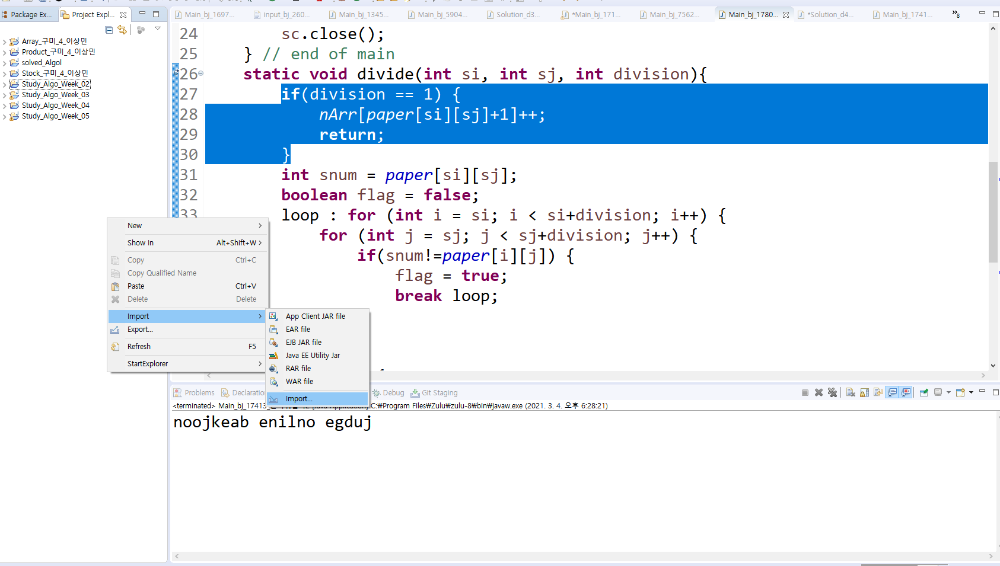   

2. git 검색 projects from Git 클릭 후 Next   

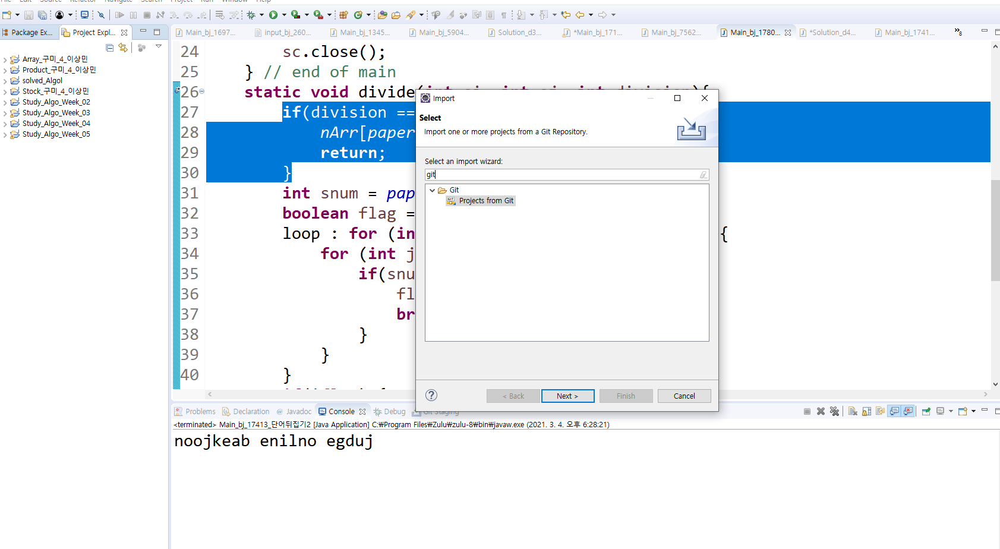    

3. Clone URI 선택 후 Next   

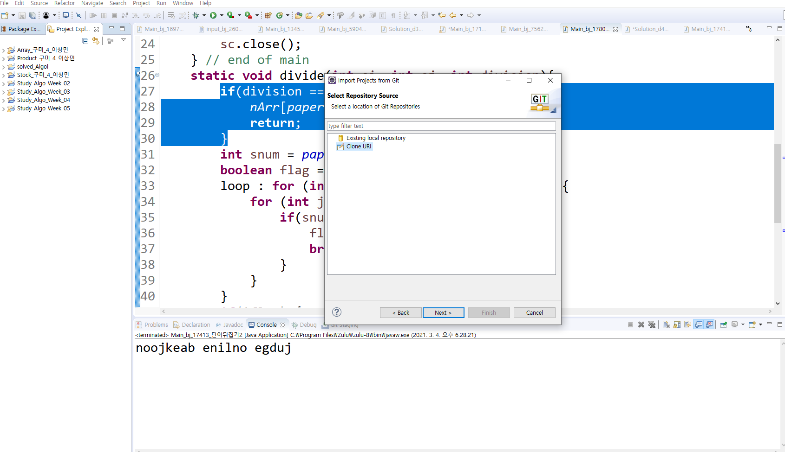  

4. 스터디 깃허브 사이트에 Code 누른 후 URI 복사   

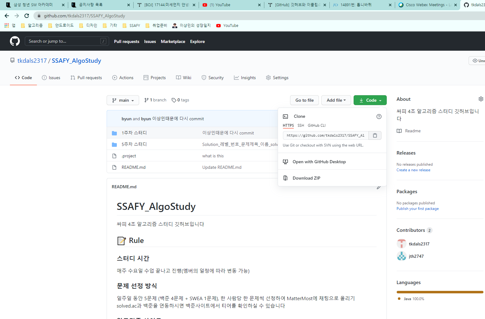  

5. 복사한 URI를 붙혀넣고 사용할 이메일과 비밀번호 기입 후 Next

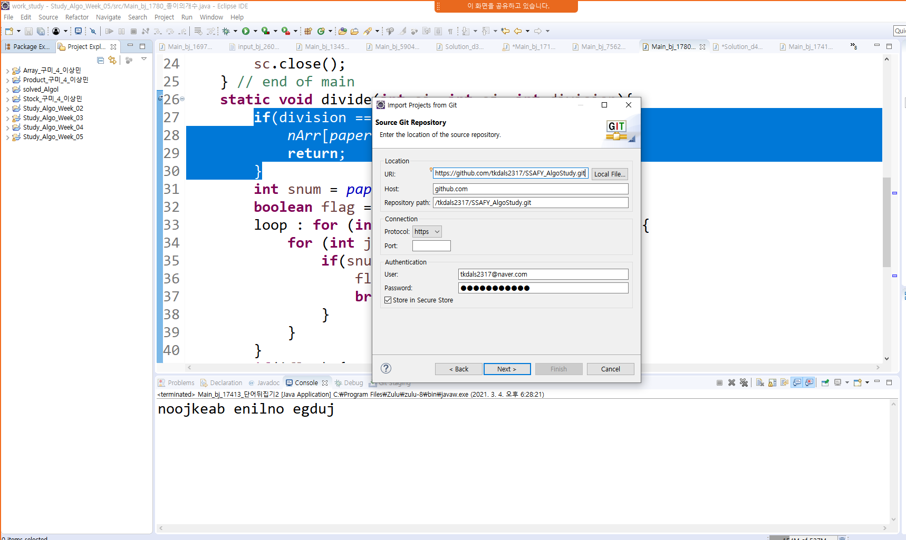

6. main 체크 된 상태로 Next   

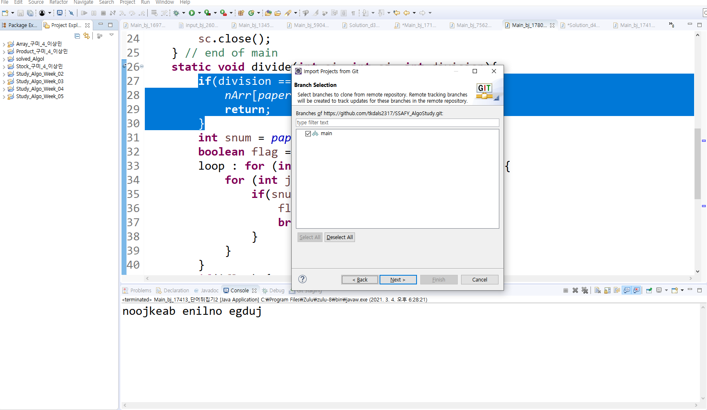  

7. 로컬 저장소 디렉토리 경로 설정 해주기(자동으로 생성됨) 

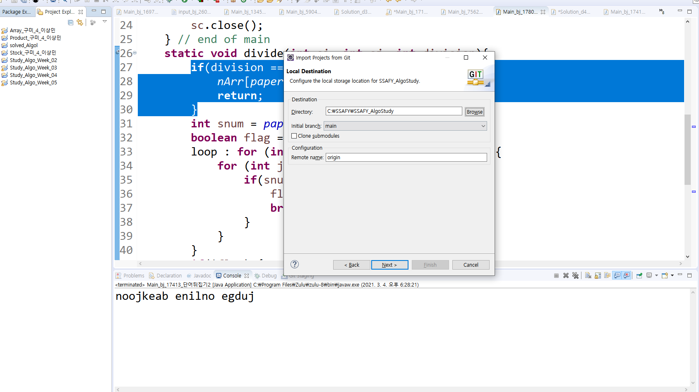  

8. import existing Eclipse projects 해주면 프로젝트가 생성됩니다! 혹시 여기서 진행이 안된다면 세번째꺼로 

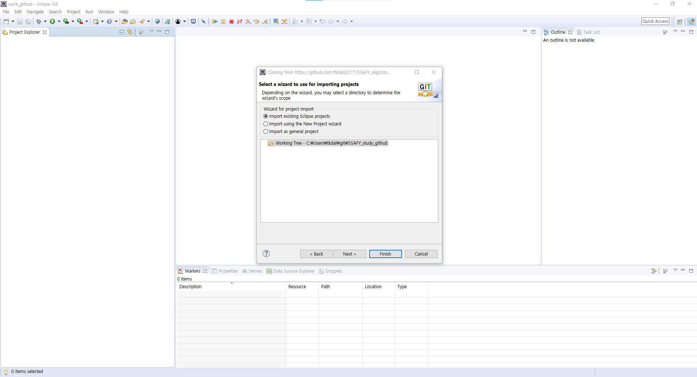   

---    
💾 How to upload File
---

매주 새 디렉터리를 만듭니다. (ex. 1주차 스터디, 2주차 스터디...)   

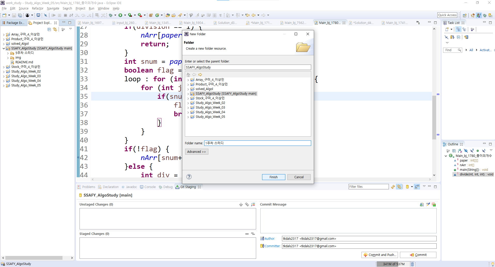   

디렉터리에 문제 디렉터리를 또 만듭니다. (ex. BOJ_S2_1234_문제명, SWEA_D2_1234_문제명...)

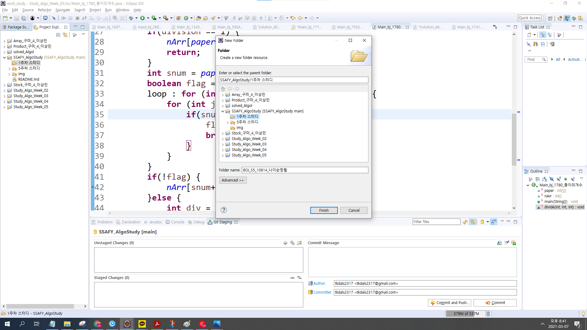  

문제 디렉터리에 각자 푼 문제를 복사 후 붙혀넣기합니다. (업로드 파일 양식 Main_티어_문제번호_문제이름_이름_solved.java, Solution_티어_문제번호_이름_X.java)   
문제를 풀었다면 파일명에 solved를 붙혀주시고 못풀었다면 X를 붙혀주세요   
     

# pull부터 합니다!!!!!!!!!!!무조건!!!!!!!!!!!!  
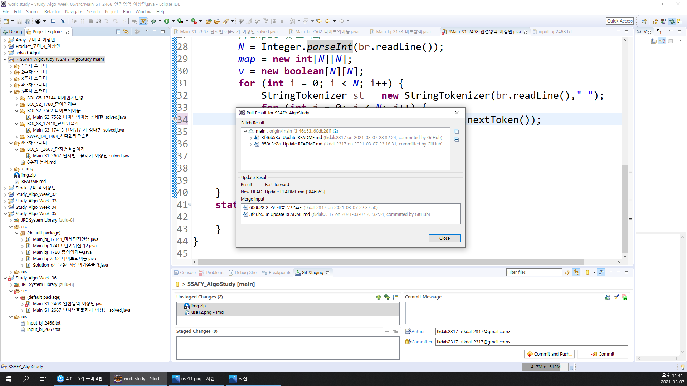  
> pull했는데 해당 주차의 디렉터리가 안보이면 따로 만들어 주세요.   

push할 때 conflict 생길 경우 pull 한번 해주고 다시 하면 됩니다.

### 파일 디렉토리에 옮긴 다음 add, 커밋메시지 작성하시고 commit and push하면 완료!
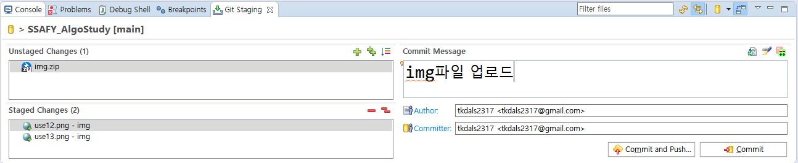  

---
