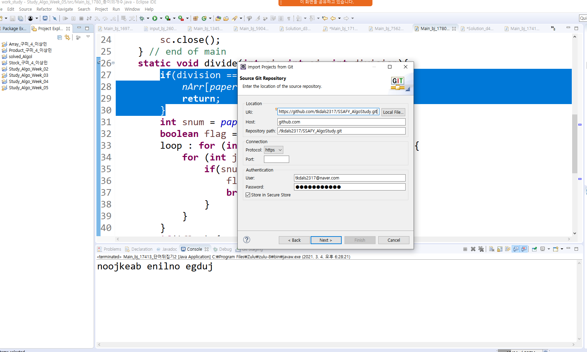

# SSAFY_AlgoStudy   

싸피 4조 알고리즘 스터디 깃허브입니다

📝 Rule
---
### 스터디 시간   
매주 수요일 수업 끝나고 진행(멤버의 일정에 따라 변동 가능)

### 문제 선정 방식    
일주일 동안 5문제 (백준 4문제 + SWEA 1문제), 한 사람당 한 문제씩 선정하여 MatterMost에 채팅으로 올리기   
solved.ac과 백준을 연동하시면 백준사이트에서 티어를 확인하실 수 있습니다   

### 알고리즘 사이트    
* [백준사이트](https://www.acmicpc.net/)
* [SWEA](https://swexpertacademy.com/main/main.do)
* [solved.ac](https://solved.ac/)
* [프로그래머스](https://programmers.co.kr/learn/challenges?tab=all_challenges)   

### 문제 선정 양식   
>단어뒤집기   
>사이트 : bj   
>티어 : s4   
>url : https://www.acmicpc.net/problem/17413   

원할한 발표를 위해 주석은 친절하게 달아줍시다!   

🍎 How to Contribute
---   
>1. 사용하고자 하는 워크스페이스의 프로젝트 익스플로러에서 import   
>   
>2. git 검색 projects from Git 클릭 후 Next   
>    
>3. Clone URI 선택 후 Next   
>  
>4. 스터디 깃허브 사이트에 Code 누른 후 URI 복사   
>  
>5. 복사한 URI를 붙혀넣고 사용할 이메일과 비밀번호 기입 후 Next
>  
>6. main 체크 된 상태로 Next   
>  
>7. 로컬 저장소 디렉토리 경로 설정 해주기(자동으로 생성됨) 
>  
>8. import existing Eclipse projects 해주면 프로젝트가 생성됩니다!
>  


>매주 새 디렉터리를 만듭니다. (ex. 1주차, 2주차 ...)
>  
디렉터리에 문제 디렉터리를 또 만듭니다. 
>  
>문제 디렉터리에 각자 푼 문제를 추가합니다.

1. 파일 생성/업로드 규칙   
파일명을 n주차/bj_1000_문제명/Main_bj_문제번호_문제이름_이름.java으로 해서 추가합니다. (n주차, bj_100_문제명은 디렉터리, Main_bj_문제번호_문제이름_이름.java는 파일)

2. Push 규칙      
-> #pull부터 합니다!!!!!!!!!!!무조건!!!!!!!!!!!!  

> pull했는데 해당 주차의 디렉터리가 안보이면 따로 만들어 주세요.   


```
$ git add .
$ git commit -m "bj_1000_홍길동"
$ git push <remote 이름> master
```

push할 때 conflict 생길 경우 pull 한번 해주고 다시 하면 됩니다.

